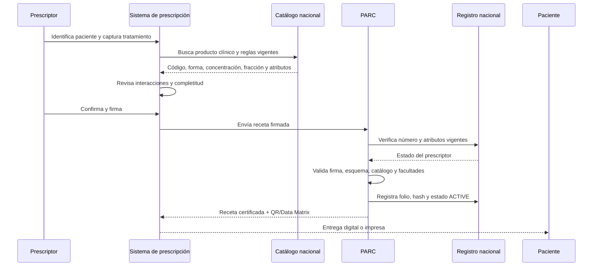
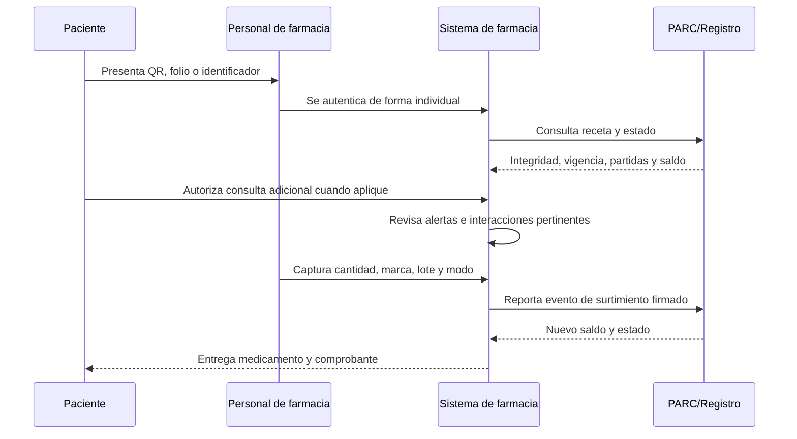
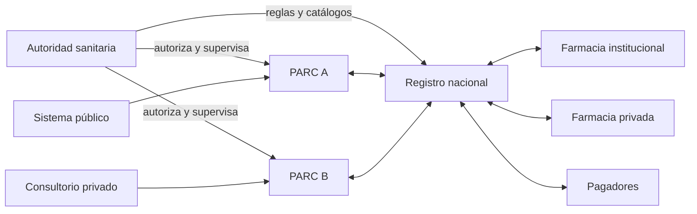

# Arquitectura operativa de Receta MX

## Qué es Receta MX

Receta MX es un **estándar abierto de intercambio y ciclo de vida de recetas electrónicas**, acompañado por una implementación de referencia. No es una aplicación única, una farmacia, un expediente clínico ni una autoridad sanitaria.

El estándar define qué datos deben viajar, cómo se identifica a cada actor, cómo se firma una receta, qué eventos pueden ocurrir y cómo cualquier sistema autorizado puede verificar el resultado.

## Separación de responsabilidades

| Actor | Decide o realiza | No debe realizar |
|---|---|---|
| Autoridad sanitaria | Reglas nacionales, catálogos autoritativos, permisos, vigilancia y sanciones | Diagnosticar, prescribir o surtir |
| Registro nacional | Publicar identificadores y atributos vigentes; recibir estados y eventos | Guardar la clave privada del prescriptor |
| PARC | Enrolar, verificar identidad/cédula/e.firma, validar facultades, certificar integridad, asignar folio y transmitir eventos | Elegir medicamentos, modificar dosis o sustituir criterio clínico |
| Prescriptor | Evaluar al paciente, decidir tratamiento, construir y firmar la receta | Autodeclararse facultades o alterar eventos ya certificados |
| Farmacia | Autenticar personal, verificar receta, revisar seguridad, surtir y reportar lote/cantidad | Modificar la orden clínica o reabrir saldos agotados |
| Paciente | Identificarse, presentar o compartir la receta y autorizar accesos adicionales | Transferir derechos de prescripción |
| Pagador | Autorizar y liquidar la cobertura económica | Cambiar el contenido clínico de la receta |

## Qué es un PARC

**PARC** significa **Proveedor Autorizado de Registro y Certificación**. Es la capa de confianza que conecta al prescriptor con el registro nacional. Una autoridad podría autorizar varios PARC para evitar dependencia de un operador único.

El PARC opera en dos momentos:

### 1. Enrolamiento del prescriptor

1. Recibe identidad, CURP, cédula, identificación y evidencia de vida.
2. Consulta o valida las fuentes autorizadas.
3. Comprueba la e.firma sin custodiar su clave privada.
4. Ejecuta controles automáticos y revisión manual.
5. Obtiene del registro el Número Nacional de Prescriptor.
6. Publica atributos vigentes: profesión, alcance, controlados permitidos y fechas de vigencia.

### 2. Certificación de cada receta

1. Recibe del sistema del prescriptor una receta ya construida clínicamente.
2. Comprueba identidad, sesión, vigencia y atributos del prescriptor.
3. Valida esquema, catálogo, fracción y facultades.
4. Comprueba la firma del prescriptor.
5. Agrega folio, sello de tiempo y evidencia de certificación.
6. Registra la receta o su huella en el registro nacional.
7. Devuelve el documento certificable y su código bidimensional.

El PARC **rechaza** una receta inválida, pero no la corrige clínicamente. Ante una interacción, puede exigir que el prescriptor reconozca la advertencia; la decisión clínica sigue siendo del prescriptor.

## Secuencia de emisión

## Secuencia de surtimiento

## Desabasto público

La portabilidad público-privada no significa que toda farmacia pueda cobrar automáticamente al gobierno. Se separan tres objetos:

1. **Receta clínica:** orden firmada y portable.
2. **Evento de desabasto:** evidencia de que la institución pública no surtió una partida.
3. **Autorización financiera:** compromiso independiente del pagador con reglas, tarifas y auditoría propias.

Así, una receta pública puede verificarse en una farmacia privada, mientras que el pago sólo ocurre cuando existe una autorización financiera válida.

## Despliegue lógico

## Límites de esta alpha

La implementación actual combina PARC y registro en un solo proceso para facilitar la demostración local. Esa combinación **no es la arquitectura final**. Los módulos deberán separarse antes de una operación real, usar certificados y sellos de tiempo regulados, catálogos firmados y conectores oficiales.
